# Architekturdokumentation: CatSlimDown

Dieses Dokument beschreibt die wesentlichen Architekturentscheidungen, die im Rahmen der Studio-Sessions für das Projekt **CatSlimDown** getroffen wurden.

# Studio Session 1

# User Story

Als Nutzer möchte ich den Gewichtsverlauf meiner Katze übersichtlich sehen, damit ich ihr helfen kann ein gesundes Zielgewicht zu erreichen.

# Generierung der Features

In der ersten Iteration habe ich ein Diagramm generieren lassen, das den Gewichtsverlauf der Katze anzeigt und das es einem ermöglicht Werte einzutragen. In der zweiten Iteration habe ich noch eine Seite hinzugefügt, in der man seine Katzen verwalten kann und Fotos der Katze hochladen kann.
In vielen weiteren Iterationen habe ich noch Fitnesstipps, Rezeptideen, ein Community-Forum, ein Abzeichen-System und weitere Features ergänzt.

# Studio Session 2

# Beobachtungsaufgabe Next.js

Mit deaktiviertem JavaScript war meine Vite-App im Wesentlichen nur weiß bzw. ohne nutzbaren Inhalt sichtbar, während die Next.js-Seite weiterhin Inhalte zeigte; das ist für mein Projekt okay, weil es als interaktive App gedacht ist und nicht als SEO-orientierte, öffentlich indexierte Content-Seite.

# Je ein Feature in Client/Server Component

Server-Component:
Als Nutzer möchte ich beim Öffnen der Seite sofort meine Katzen und den letzten Gewichtsverlauf sehen, ohne Ladespinner, damit ich direkt loslegen kann.

Client-Component:
Als Nutzer möchte ich neue Gewichtseinträge direkt hinzufügen können, ohne Seitenreload, damit die Eingabe schnell und flüssig bleibt.

# Architekturentscheidung (Next.js vs. Vite)

Ich habe mich bewusst für Vite entschieden, da die Website interaktiv ist und einen eher app-artigen Ablauf hat. Eine schnelle Client-Interaktion liegt im Fokus. Next.js würde nur dann Vorteile bringen, wenn ich öffentlich auffindbare Inhalte hätte, die von Suchmaschinen sauber idexiert werden sollten. Trotz meines Community-Forums entscheide ich mich für Vite, weil das Forum hauptsächlich innerhalb der App, im Login-Bereich genutzt wird und Interaktivität wichtiger ist als die Suchmaschinenoptimierung. 

# Studio Session 3

# Ressourcen und API-Struktur

Haupt-Ressourcen:

-users
-cats
-weightentries
-posts
-reactions
-badges
-foodanalyses
-calorieentries

Content-Ressourcen (read only):

-tips
-recipes

Hierarchie:

Ein User: 
hat cats
erstellt posts
bekommt badges
hat calorieentries

Eine Cat:
hat weightentries

Ein Post:
hat Reactions

Eine Foodanalyse
gehört zu einem user
basiert auf einem Bild-Upload

Gewählte API-Struktur:

Ich habe mich für ein flaches Design mit Query-Parametern entschieden, da es flexibel, leicht erweiterbar und gut für die Verwendung im Frontend geeignet ist. Beziehungen zwischen den Ressourcen werden über IDs dargestellt, z.B: 

-/cats?userID=123
-/weight-entries?catID=456
-/posts?userID=123

Zusätzlich nutze ich pragmatisches Nesting mit maximal einer Ebene, wenn es die Lesbarkeit verbessert, z.B.:

-/cats/{id}/weight-entries
-/posts/{id}/reactions

Auf tiefere Verschachtelungen verzichte ich bewusst, da diese die Komplexität erhöhen und schwer wartbar sind.

# API-Tests (ohne Frontend)

Die Cats-API wurde manuell mit Postman/Hoppscotch getestet.

Basis-URL:
- http://localhost:3001

Verwendete Collection:
- backend/Cats-API.postman_collection.json

# 1) GET /api/cats

Erfolgsfall:
- Request: GET /api/cats
- Erwartet: 200 OK
- Ergebnis: 200 OK
- Beleg: Erfolgsfall (200):
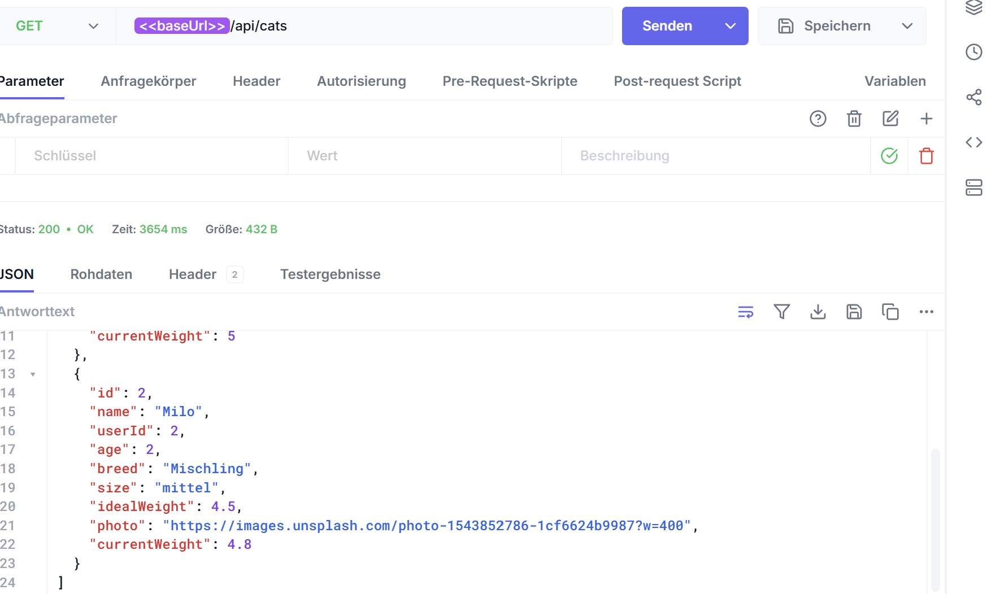

Fehlerfall:
- Request: GET /api/cats?userId=abc
- Erwartet: 400 Bad Request
- Ergebnis: 400 Bad Request
- Beleg: Fehlerfall (400 bei ungueltigem userId):
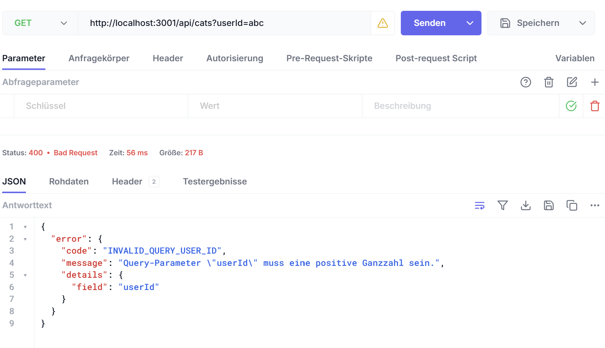


# 2) GET /api/cats/:id

Erfolgsfall:
- Request: GET /api/cats/1
- Erwartet: 200 OK
- Ergebnis: 200 OK
- Beleg: Erfolgsfall (200):
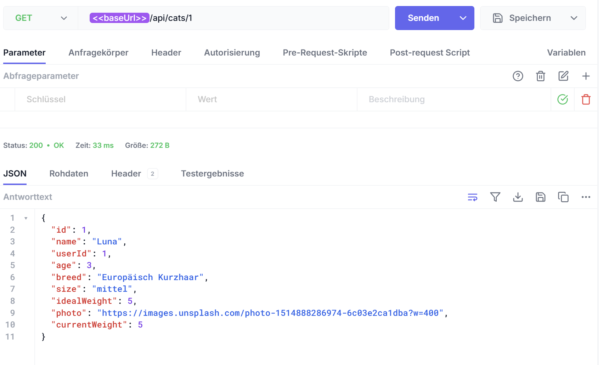

Fehlerfall:
- Request: GET /api/cats/999999
- Erwartet: 404 Not Found
- Ergebnis: 404 Not Found
- Beleg: Fehlerfall (404):
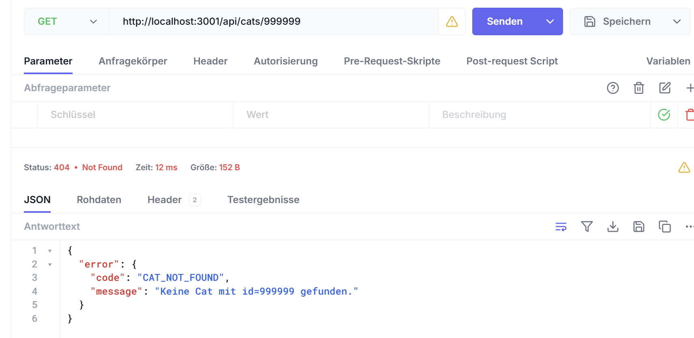


# 3) POST /api/cats

Erfolgsfall:
- Request: POST /api/cats mit gueltigem Body
- Erwartet: 201 Created
- Ergebnis: 201 Created
- Beleg: Erfolgsfall (201):
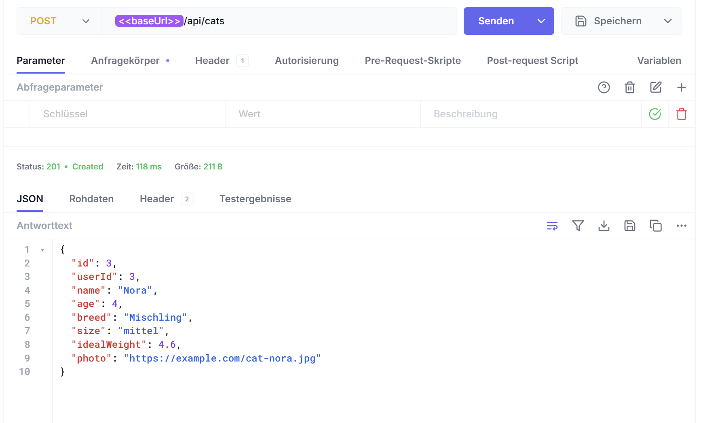

Fehlerfall:
- Request: POST /api/cats mit fehlendem Pflichtfeld name
- Erwartet: 400 Bad Request
- Ergebnis: 400 Bad Request
- Beleg: Fehlerfall (400, name fehlt):
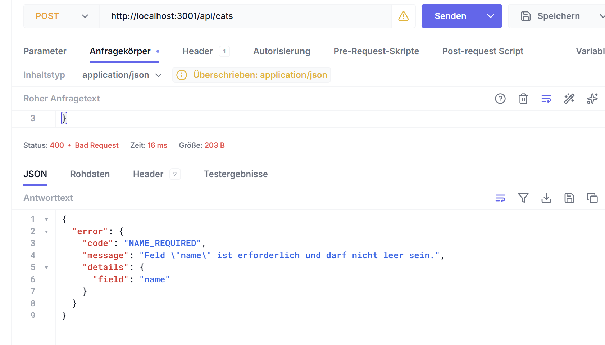


# 4) PUT /api/cats/:id

Erfolgsfall:
- Request: PUT /api/cats/1 mit gueltigem Body
- Erwartet: 200 OK
- Ergebnis: 200 OK
- Beleg: Erfolgsfall (200):
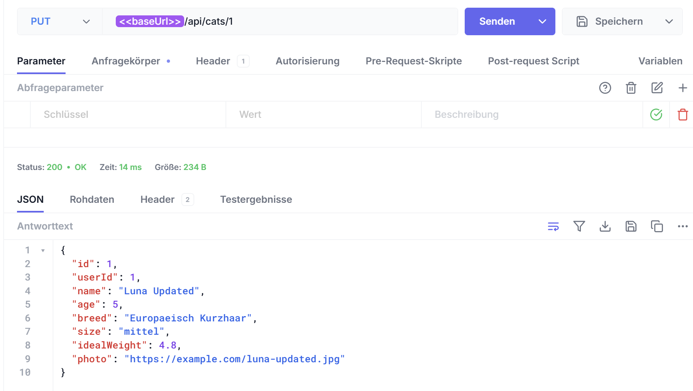

Fehlerfall:
- Request: PUT /api/cats/1 mit ungueltigen Daten (z. B. name leer)
- Erwartet: 400 Bad Request
- Ergebnis: 400 Bad Request
- Beleg: Fehlerfall (400, ungueltige Daten):
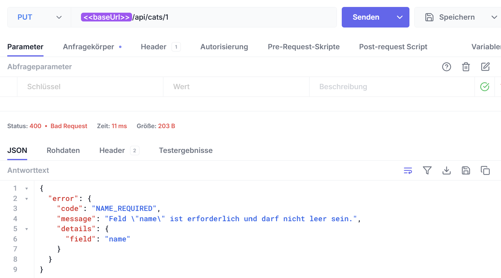


# 5) DELETE /api/cats/:id

Erfolgsfall:
- Request: DELETE /api/cats/2
- Erwartet: 204 No Content
- Ergebnis: 204 No Content
- Beleg: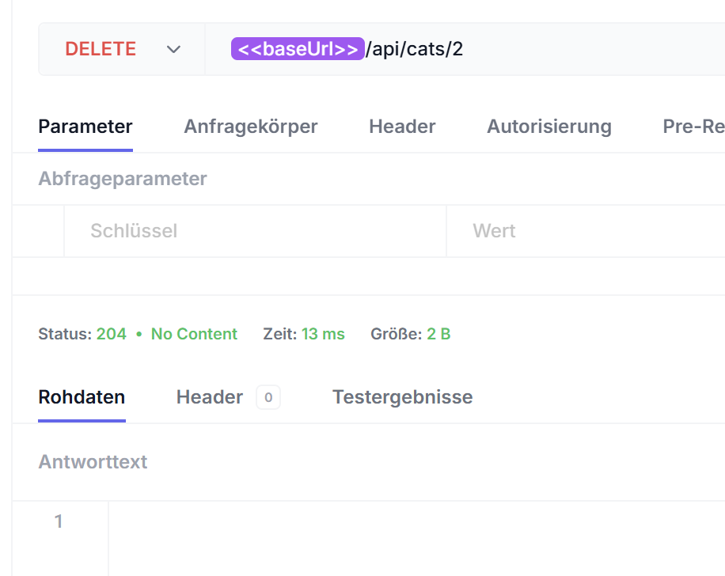

Fehlerfall:
- Request: DELETE /api/cats/999999
- Erwartet: 404 Not Found
- Ergebnis: 404 Not Found
- Beleg:Fehlerfall (404):
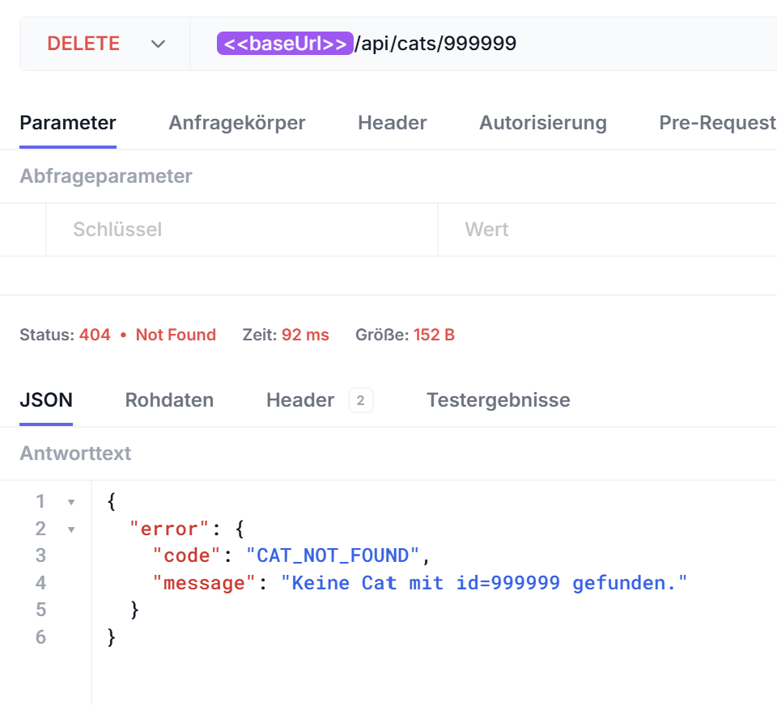

# Studio Session 4

# Datenschema

### users

| Feld | Typ | Constraint |
| --- | --- | --- |
| id | int | PK |
| email | string | NOT NULL, UNIQUE |
| name | string | NOT NULL |
| avatarUrl | string | optional |
| createdAt | datetime | NOT NULL |

### cats

| Feld | Typ | Constraint |
| --- | --- | --- |
| id | int | PK |
| userId | int | FK -> users.id, NOT NULL |
| name | string | NOT NULL |
| age | int | optional |
| breed | string | NOT NULL |
| size | enum | NOT NULL (klein, mittel, gross) |
| idealWeight | float | NOT NULL |
| photo | string | optional |
| createdAt | datetime | NOT NULL |

### weight_entries

| Feld | Typ | Constraint |
| --- | --- | --- |
| id | int | PK |
| catId | int | FK -> cats.id, NOT NULL |
| date | date | NOT NULL |
| weight | float | NOT NULL |

### calorie_entries

| Feld | Typ | Constraint |
| --- | --- | --- |
| id | int | PK |
| catId | int | FK -> cats.id, NOT NULL |
| date | date | NOT NULL |
| consumed | float | NOT NULL |
| burned | float | NOT NULL |
| basalBurned | float | NOT NULL |

### community_posts

| Feld | Typ | Constraint |
| --- | --- | --- |
| id | int | PK |
| userId | int | FK -> users.id, optional |
| author | string | NOT NULL |
| text | string | NOT NULL |
| photo | string | optional |
| beforeWeight | float | optional |
| nowWeight | float | optional |
| likes | int | NOT NULL, default 0 |
| hearts | int | NOT NULL, default 0 |
| createdAt | datetime | NOT NULL |

### post_reactions

| Feld | Typ | Constraint |
| --- | --- | --- |
| id | int | PK |
| postId | int | FK -> community_posts.id, NOT NULL |
| userId | int | FK -> users.id, NOT NULL |
| type | enum | NOT NULL (like, thumbsUp) |
| createdAt | datetime | NOT NULL |

### community_messages

| Feld | Typ | Constraint |
| --- | --- | --- |
| id | int | PK |
| userId | int | FK -> users.id, optional |
| userName | string | NOT NULL |
| avatar | string | optional |
| text | string | NOT NULL |
| createdAt | datetime | NOT NULL |

# Beziehungen

- users 1:n cats
- cats 1:n weight_entries
- cats 1:n calorie_entries
- community_posts 1:n post_reactions
- users 1:n post_reactions
- users n:m community_posts ueber post_reactions 

# Pflichtfelder

- users: email, name, createdAt
- cats: userId, name, breed, size, idealWeight, createdAt
- weight_entries: catId, date, weight
- calorie_entries: catId, date, consumed, burned, basalBurned
- community_posts: author, text, likes, hearts, createdAt
- post_reactions: postId, userId, type, createdAt
- community_messages: userName, text, createdAt

# Persistenz-Test

Nach dem Senden des Eintrag POST /api/cats erhielt ich wie erwartet die Antwort Status 201 Created.

Beleg: 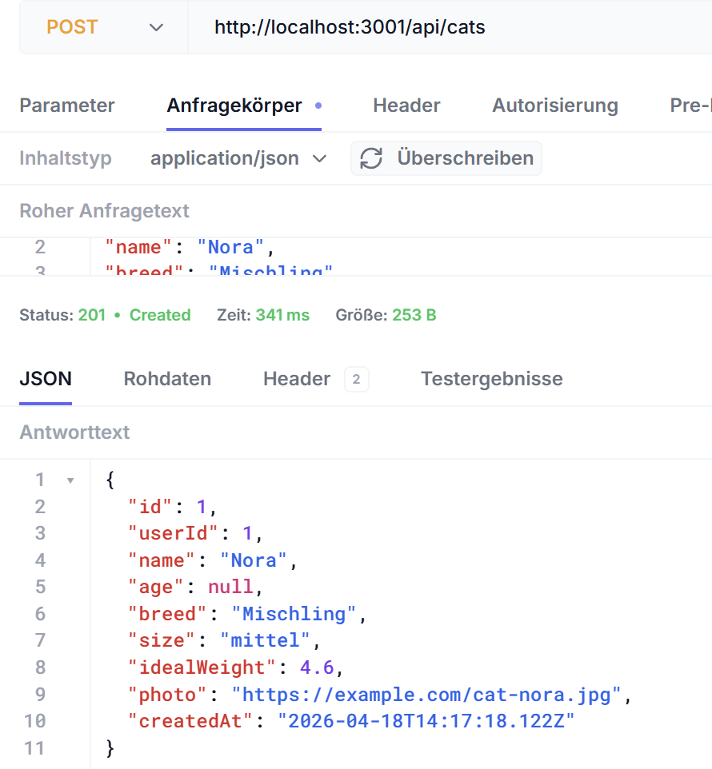

Anschließend wurde der Server gestoppt und wieder neu gestartet, um zu überprüfen, ob der Eintrag noch vorhanden ist. Dann wurde der Eintrag GET/api/cats gesendet und ich erhielt die Antwort Status 200 OK.

Beleg: 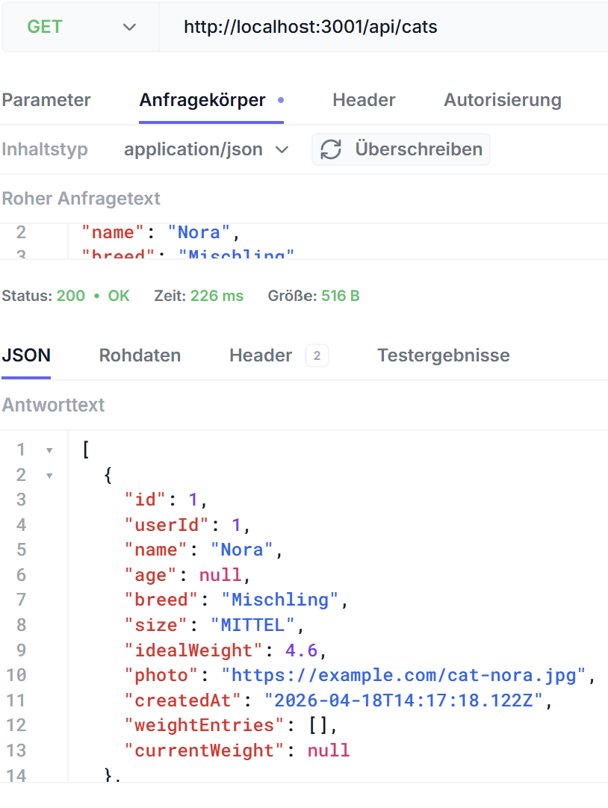

Der Test war erfolgreich, da der neu angelegte Eintrag nach dem Neustart weiterhin vorhanden war.

# Architekturentscheidung

Aus architektonischer Sicht sollten vor allem strukturierte und beziehungsreiche Daten in der Datenbank gespeichert werden,
zum Beispiel:
User, Cats, Gewichtseinträge und Community-Posts.

Redis wäre für kurzlebige Daten wie Sessions, Caching-Ergebnisse oder temporäre Zähler sinnvoll, da diese Daten schnell verfügbar sein müssen, aber nicht dauerhaft gespeichert werden.

Für Bilder und größere Uploads ist langfristig ein Cloud Object Store wie S3 geeigneter, damit die Datenbank entlastet wird und sich auf relationale Daten konzentrieren kann.

# Studio Session 5

# Lücken in der API

Im aktuellen Stand sind die Cats-Endpunkte ohne Login/Token aufrufbar. Ein anonymer Nutzer kann daher Dinge tun, die er nicht dürfte:

1. Er kann mit GET /api/cats alle Katzen-Datensätze aller Nutzer auslesen (inklusive Gewichtsverläufe), sobald kein userId-Filter gesetzt ist.
2. Er kann mit GET /api/cats/:id gezielt fremde Datensätze per ID abrufen und durch Ausprobieren von IDs Daten anderer Nutzer enumerieren.
3. Er kann mit DELETE /api/cats/:id beliebige Katzen löschen, auch wenn sie einem anderen Nutzer gehören, da keine Authentifizierung und keine Besitzprüfung erfolgt.

# Authenticate-Middleware

Wenn jemand den JWT-Payload manuell verändert, zum Beispiel die userId auf eine fremde ID setzt, funktioniert das nicht. Der JWT ist serverseitig mit dem Secret aus der .env-Datei signiert. Sobald der Payload verändert wird, passt die Signatur nicht mehr zum Token, und jwt.verify lehnt ihn ab. Die Middleware setzt req.user deshalb nur dann, wenn der Token unverändert und echt signiert ist; sonst kommt direkt 401.

# OWASP-Audit

| OWASP-Punkt | Status | Code-Stelle | Fix / Hinweis |
| --- | --- | --- | --- |
| A01 Broken Access Control | teilweise abgedeckt | [backend/server.js](backend/server.js), [backend/routes/auth.js](backend/routes/auth.js) | Cats, Weights, Calories und Community sind authentifiziert; Community-Posts werden jetzt zusätzlich nur vom Besitzer gelöscht. |
| A02 Cryptographic Failures | abgedeckt | [backend/routes/auth.js](backend/routes/auth.js), [backend/prisma/schema.prisma](backend/prisma/schema.prisma) | Passwörter werden mit bcrypt gehasht und der JWT-Secret kommt aus `.env`. |
| A03 Injection | abgedeckt / beobachtbar | [backend/server.js](backend/server.js) | Runtime-Zugriffe laufen über Prisma, es gibt keine rohe SQL-Konkatenation; XSS-Risiko bleibt clientseitig davon abhängig, wie Daten gerendert werden. |
| A07 Authentication Failures | verbessert | [backend/routes/auth.js](backend/routes/auth.js) | Einheitliche Login-Fehlermeldung bleibt erhalten; zusätzlich gibt es nun stärkere Passwortregeln und ein einfaches Rate-Limit für Login-Versuche. |

# Studio Session 6: Testing

# Test-Pyramide für CatSlimDown

Die Testsuite folgt der Test-Pyramide mit drei Ebenen. Unten: viele schnelle Unit-Tests, in der Mitte: Integrationstests, oben: wenige E2E-Tests.

| Ebene | Was testen wir bei uns? | Tool |
|-------|--------------------------|------|
| **Unit** | Email-Validierung (isValidEmail), Passwort-Anforderungen (min. 10 Zeichen, Buchstaben + Zahlen), Input-Normalisierung (trim, toLowerCase), Gewichtsberechnung | Vitest |
| **Integration** | POST /auth/register → User in DB + JWT-Token, POST /auth/login → Authentifizierung, GET /cats?userId=X → nur eigene Katzen, POST /cats → neue Katze speichern, PUT /cats/:id → Katze aktualisieren, DELETE /cats/:id → Katze löschen, GET /cats/:id/weight-entries → Gewichtsverlauf | Vitest |
| **E2E** | Login-Flow (Register, Login, Session bleibt), neue Katze erstellen im Frontend → im Dashboard sichtbar, Gewichtsverlauf erfassen → Chart aktualisiert sich, Community-Post erstellen | Cypress |

# Zwei kritischste Dinge

Falls diese kaputt gehen, funktioniert das ganze Projekt nicht:

1. **Authentication & JWT-Token**
   - Problem: Ohne funktionierende Auth kann niemand auf sein Konto/seine Katzen zugreifen
   - Betroffen: Register, Login, Token-Validierung in Middleware
   - Impact: App ist komplett unbenutzbar

2. **Datenbank-Persistierung von Cats**
   - Problem: Wenn Katzen nicht mehr gespeichert/geladen werden, ist das Kernfeature weg
   - Betroffen: POST /cats, GET /cats, PUT /cats, DELETE /cats
   - Impact: Nutzerdaten gehen verloren oder sind nicht mehr abrufbar

# Studio Session 7: Real-time Web

# Echtzeit-Bedarf der App

| Frage | Antwort |
| --- | --- |
| **Gibt es Daten in eurer App, die sich ändern können, während ein anderer Nutzer die Seite offen hat?** | Ja, im Community-Forum (neue Posts, Likes, Reaktionen) sowie in der Live-Chat-Komponente können sich Daten ändern, während ein anderer Nutzer online ist. |
| **Müssen Änderungen sofort sichtbar sein – oder reicht ein Reload?** | Für den Live-Chat müssen Nachrichten sofort sichtbar sein, da sonst kein flüssiges Gespräch möglich ist. Für Posts, Likes oder neue Gewichtseinträge würde ein manueller Reload oder Polling ausreichen. |
| **Ist die Kommunikation einseitig (Server → Client) oder bidirektional (beide senden)?** | Für den Live-Chat ist die Kommunikation bidirektional (Clients senden Nachrichten an den Server, Server verteilt sie an alle verbundenen Clients). Für reine Status-Updates (z. B. neue Likes im Forum) wäre einseitige Kommunikation (Server $\rightarrow$ Client) ausreichend. |
| **Wie viele Clients könnten gleichzeitig verbunden sein?** | Da es sich um ein Übungsprojekt handelt, sind meist nur wenige Clients (1-10) gleichzeitig online. Für ein Produktivszenario müsste die Lösung auf Hunderte zeitgleiche Verbindungen skalieren. |

# Begründete Technologieentscheidung

Ich entscheide mich für **WebSockets (mittels socket.io)** für die Live-Chat-Komponente, da hier eine bidirektionale Echtzeit-Zwei-Wege-Kommunikation erforderlich ist. Für alle anderen Bereiche (wie das Eintragen des Gewichts der Katze) ist Echtzeit-Kommunikation aus Produktivsicht **nicht notwendig** (hier reicht Request-Response / Reload aus), weshalb eine eventuelle Implementierung in diesen Bereichen als reine Lernübung gekennzeichnet wird.

# Server-Sent Events (SSE): Einseitige Live-Updates

Ich habe einen SSE-Mechanismus implementiert, damit Änderungen (z. B. neue Nachrichten, Posts oder Reaktionen) in Echtzeit an alle verbundenen Clients gestreamt werden, wodurch die Listen ohne Seiten-Reload sofort aktualisiert werden.


# WebSockets mit socket.io: Bidirektionale Kommunikation

Ich habe Socket.io integriert, um eine echte bidirektionale Echtzeit-Zwei-Wege-Kommunikation für die Community-Bereiche (Chat & Forum) zu ermöglichen. Im Gegensatz zu SSE können hiermit Updates direkt im Frontend-State eingepflegt werden, ohne dass die Liste komplett neu vom DB-Server abgerufen werden muss.

# SSE vs. WebSockets – Direktvergleich

| Kriterium | SSE | WebSockets |
| --- | --- | --- |
| **Richtung** | Server → Client | Bidirektional |
| **Komplexität im Code** | Gering | Mittel |
| **Reconnect bei Verbindungsabbruch** | Automatisch (Browser) | Manuell / socket.io übernimmt |
| **Geeignet für euer Projekt** | ❌ Nicht optimal | ✅ Ja, sehr geeignet |
| **Warum?** | Da das Haupt-Echtzeit-Feature ein Live-Gruppen-Chat ist, wäre ein einseitiger Stream (Server → Client) unvollständig. Für das Senden von Nachrichten müsste der Client weiterhin klassische HTTP POST-Requests nutzen. | Da der Chat und das Forum echte Zwei-Wege-Interaktion erfordern, ermöglicht socket.io sowohl schnelles Senden als auch sofortiges Verteilen per Broadcast ohne REST-API-Overhead. |

### Verhalten bei Server-Neustart

**Was passiert in eurer aktuellen Implementierung, wenn der Server neu startet – verlieren verbundene Clients ihre Verbindung, und wie verhält sich die App dann?**

1. **Verbindungsverlust**:
   Ja, sobald der Backend-Server beendet oder neu gestartet wird, wird die zugrundeliegende TCP-Verbindung geschlossen. Alle geöffneten Browser-Tabs verlieren sofort ihre aktive Verbindung zu dem SSE-Endpoint (`/api/events`) und dem socket.io-Port.

2. **Verhalten der App**:
   - **Bei Server-Sent Events (SSE)**: Das native `EventSource`-Objekt im Browser bemerkt den Verbindungsabbruch und wechselt in einen Reconnect-Status. Es versucht standardmäßig automatisch in kurzen Intervallen (meist ca. 3 Sekunden), die Verbindung zum Server neu aufzubauen. Sobald der Server wieder läuft, verbindet sich der Browser nahtlos von selbst neu.
   - **Bei WebSockets (socket.io)**: Die `socket.io-client`-Bibliothek fängt den Verbindungsabbruch ab und versucht fortlaufend mit einem exponentiellen Backoff-Algorithmus, den Socket neu zu verbinden. Während der Server offline ist, werden Verbindungsfehler in der Konsole geloggt (`Socket-Verbindungsfehler`). Sobald der Server wieder erreichbar ist, stellt socket.io die Verbindung im Hintergrund automatisch wieder her. Für den Nutzer ist kein manuelles Neuladen der Seite erforderlich.

#  Einschätzung des Agenten:
1. **Langfristiger Echtzeit-Nutzen (Chat):** Die Live-Chat-Komponente (`/api/community/messages`) profitiert massiv von WebSockets, da unmittelbares Feedback für eine flüssige Konversation notwendig ist. Polling würde hier entweder zu Verzögerungen führen oder bei hoher Frequenz unnötigen Traffic verursachen.
2. **Polling als ehrlichere Lösung (Forum & Reaktionen):** Für das Community-Forum (`/api/community/posts` und `/api/community/posts/:id/reactions`) wäre Polling oder einfaches Laden beim Seitenwechsel die pragmatischere Lösung. Es ist nicht zeitkritisch, wann neue Beiträge oder Likes erscheinen; Echtzeit-Verbindungen halten hier nur unnötig Sockets offen.
3. **Kein Echtzeit-Nutzen (Gewicht & Kalorien):** Die Kernfeatures zur Erfassung von Gewichten (`/api/weights`) und Kalorien (`/api/calories`) werden nur vom jeweiligen Besitzer gepflegt. Da keine kollaborative Bearbeitung stattfindet, ist ein klassischer Request-Response-Cycle vollkommen ausreichend; Echtzeit-Kommunikation wäre hier reine Ressourcenverschwendung.

# Meine Einschätzung
Ich stimme dieser Einschätzung vollkommen zu. Während der Live-Chat zwingend auf WebSockets angewiesen ist, um sich flüssig anzufühlen, wurde die Echtzeit-Kompatibilität für Posts und Reaktionen als Lernübung implementiert; im produktiven Einsatz wäre ein ressourcenschonenderes Polling für das Forum völlig ausreichend und die Gewichtsverwaltung benötigt keinerlei Echtzeit-Synchronisation.

# Studio Session 8: Async Messaging – E-Mail & Web Push 

# Notification-Bedarf

| Event in eurer App | Notification sinnvoll? | Typ (Transactional / Product / Marketing) | Kanal (E-Mail / Push / keiner) | Begründung |
| --- | --- | --- | --- | --- |
| **Passwort geändert** | Ja | Transactional | E-Mail | Sicherheitsrelevant; benötigt Dokumentation und Persistenz, falls die Änderung unautorisiert war. |
| **Neue Live-Chat-Nachricht** | Ja (falls Empfänger offline) | Product | Web Push | Zeitkritische Interaktion; E-Mails würden das Postfach überfluten und sind zu langsam für Chat-Unterhaltungen. |
| **Neue Antwort auf Forum-Beitrag** | Ja | Product | E-Mail oder Web Push | Steigert die Community-Interaktivität, ist aber nicht so dringend wie Chat; eine gesammelte E-Mail ist hier nutzerfreundlich. |
| **Wöchentliche Gewichts-Erinnerung** | Ja | Product | Web Push (oder E-Mail) | Unterstützt die Kernroutine des Benutzers. Eine Push-Benachrichtigung direkt auf dem Endgerät ist am effektivsten. |

# Beantwortung der Leitfragen

* **Gibt es Events, bei denen der Nutzer sofort reagieren muss – oder reicht eine Mail, die er später liest?**
  Es gibt keine absolut lebenskritischen Events in der App. Passwortänderungen und Sicherheitsereignisse verlangen eine zeitnahe, aber nicht sekundenaktuelle Reaktion; hierfür ist eine E-Mail als dauerhafter Nachweis optimal. Für Live-Chat-Nachrichten reicht Web Push, um das direkte Gespräch zu erleichtern, wenn der Empfänger die App nicht geöffnet hat.
* **Habt ihr Marketing-Content geplant, der ein explizites Opt-in braucht?**
  Nein, für CatSlimDown ist aktuell kein Marketing-Content (z. B. Newsletter oder Futter-Werbung) vorgesehen. Falls dies in Zukunft implementiert wird, muss ein rechtssicheres Double-Opt-in-Verfahren per E-Mail aufgebaut werden.
* **Wie viele verschiedene Events würden pro Stunde realistisch Notifications auslösen?**
  Sehr wenige (durchschnittlich < 1 Notification pro Stunde und User). Da die App primär für die persönliche Dokumentation der Katze genutzt wird, sind Community-Interaktionen unregelmäßig und führen zu einer sehr geringen Benachrichtigungslast.

# Begründete Kanalentscheidung

Ich entscheide mich für die folgenden zwei Kanäle:
1. **E-Mail für transaktionale Sicherheitsnachrichten (z. B. Passwortänderungen):** E-Mails sind plattformunabhängig, langlebig, archivierbar und ideal für formelle Sicherheitsbenachrichtigungen geeignet.
2. **Web Push für interaktive Updates (z. B. Live-Chat-Erwähnungen & Wiege-Erinnerungen):** Web Push bietet eine sofortige, aufmerksamkeitsstarke Rückmeldung auf dem Desktop oder Mobilgerät des Nutzers, ohne das E-Mail-Postfach mit flüchtigen Chat-Fragmenten vollzuspammen.

# Kritische Prüfung der Templates & Benachrichtigungen

* **✅ Enthält das Template alle Infos, die der Nutzer braucht – ohne sich einloggen zu müssen?**
  * *E-Mail:* Ja, der Name des Autors und der genaue Text des Beitrags werden direkt im Template gerendert, sodass der Empfänger die gesamte Nachricht sofort lesen kann.
  * *Push-Notification:* Ja, der Absender und der Chat-Text werden direkt in der Benachrichtigung angezeigt.
* **✅ Gibt es einen direkten Deep Link zur betroffenen Ansicht (nicht nur zur Startseite)?**
  * *E-Mail:* Ja, der Button „Beitrag ansehen“ verlinkt direkt auf `/community#post-{id}`.
  * *Push-Notification:* Ja, der Service Worker öffnet bzw. fokussiert die `/community`-Seite bei Klick auf die Benachrichtigung.
* **✅ Ist Betreff / Notification-Titel klar, was das Event war – in unter 50 Zeichen?**
  * *E-Mail:* Ja, der Betreff `Neuer Beitrag von [Name] im Forum` ist extrem präzise und hat bei typischen Namen ca. 30–35 Zeichen (deutlich unter 50 Zeichen).
  * *Push-Notification:* Ja, der Titel `[Name] schreibt im Chat` hat ca. 20–25 Zeichen und informiert sofort über das Ereignis.
* **✅ Ist der Notification-Body unter 120 Zeichen?**
  * *Push-Notification:* Ja, typische Chatnachrichten sind extrem kurz. Sollte eine Nachricht länger sein, kürzt das Betriebssystem bzw. der Browser diese automatisch ab.

# Studio Session 9: Modularer Monolith

# Bestandsaufnahme

| Datei | Wofür ist sie verantwortlich? | Greift sie auf Daten anderer Bereiche zu? |
| --- | --- | --- |
| **`backend/server.js`** | Haupteinstiegspunkt. Konfiguration von Express, CORS, Cookies, WebSocket (socket.io), Fehler-Middleware. Enthält direkt Inline-API-Endpunkte für Community-Nachrichten/Posts, Gewichte und Kalorien. | **Ja.** Führt direkte DB-Abfragen über Prisma auf `communityPost`, `communityMessage` und `cat` aus. |
| **`backend/routes/auth.js`** | Benutzer-Authentifizierung (Login, Registrierung, Profilverwaltung, Passwortänderung). | **Nein.** Agiert eigenständig auf der `User`-Tabelle. |
| **`backend/routes/cats.js`** | CRUD-Endpunkte für Katzen und der Server-Sent Events (SSE) events Stream. | **Ja.** Verwendet `resolveCatOwnerId`, um über `prisma.user` den standardmäßigen Katzenbesitzer zu ermitteln. |

# Analyse der Route-Handler und Geschäftslogik

Aus architektonischer Sicht gibt es in meinem aktuellen Express-Backend folgende strukturelle Probleme und Verbesserungspotenziale:

* **Direkte Datenbankzugriffe und Geschäftslogik in `server.js`:**
  Der Haupteinstiegspunkt `server.js` ist überladen. Die Routen für Community-Nachrichten (`/api/community/messages`), Community-Posts (`/api/community/posts`), Gewichte (`/api/weights`) und Kalorien (`/api/calories`) sind direkt in `server.js` definiert. Diese enthalten nicht nur HTTP-Routing, sondern auch:
  - Direktes Prisma-Querying (Datenbankzugriff).
  - Validierung von Request-Bodys.
  - Geschäftslogik (z. B. asynchroner E-Mail-Versand und Versenden von Web Push Notifications).
  *Verbesserung:* Diese sollten in dedizierte Controller/Router (z. B. `routes/community.js`, `routes/weights.js`, `routes/calories.js`) ausgelagert werden.
* **Vermischung von Validierung und Routing in `routes/auth.js`:**
  Die Überprüfung von Passwort-Komplexitätsregeln (mindestens 10 Zeichen, Kombination aus Buchstaben und Ziffern) geschieht inline in `auth.js` (über Hilfsfunktionen).
  *Verbesserung:* Diese Hilfsfunktionen sollten in ein separates Validierungs-Modul (z. B. `utils/validation.js`) ausgelagert werden.
* **Engmaschige Kopplung von Ressourcen in `routes/cats.js`:**
  Der Katzen-Router greift über `resolveCatOwnerId` direkt auf die `User`-Tabelle zu, um den ersten User der Datenbank als Fallback-Eigentümer zu bestimmen.
  *Verbesserung:* Die Benutzerermittlung sollte entkoppelt und über ein Benutzer-Modul/Service bereitgestellt werden, anstatt direkt in den Katzen-CRUD-Operationen verankert zu sein.

# Bounded Contexts

Meine Domäne lässt sich in drei klar abgegrenzte Bounded Contexts unterteilen:

```text
Cats & Core Context      Users & Auth Context     Community Context
───────────────────      ────────────────────     ──────────────────
Cat                      User                     CommunityPost
WeightEntry              Session / JWT            CommunityMessage
CalorieEntry             Passwort-Reset           PostReaction
```

# Kommunikation zwischen den Kontexten:
* Der **Cats-Kontext** und der **Community-Kontext** fragen den **Users-Kontext** an, um die Identität und Berechtigungen eines Benutzers zu überprüfen; übergeben wird dabei ausschließlich die eindeutige `userId` (sowie der `userName` für Anzeigenzwecke).
* Der **Community-Kontext** kommuniziert optional mit dem **Cats-Kontext**, um bei Erfolgs-Posts das aktuelle Gewicht und den Gewichtsverlauf einer Katze auszulesen und im Forum anzuzeigen, ohne jedoch Zugriff auf interne Berechnungslogiken zu erhalten.


# Modulschnittstellen

### `auth.service.js`
* **öffentlich (nach außen sichtbar):**
  * `getUserById(userId)`: Liefert die User-ID eines bestimmten Benutzers.
  * `getFirstUser()`: Liefert den ersten registrierten Benutzer der Datenbank.
  * `getOrCreateDefaultUser()`: Erstellt oder holt den default Fallback-User.
* **intern (nur für Auth-Modul):**
  * *Bisher keine rein internen Service-Funktionen (Logik liegt primär in den Route-Hilfsfunktionen wie `parseRegisterPayload`).*

### `cats.service.js`
* **öffentlich (nach außen sichtbar):**
  * `createCat(body, user, helpers)`: Validiert und erstellt eine neue Katze.
  * `deleteCat(catIdStr, user, helpers)`: Validiert und löscht eine Katze.
* **intern (nur für Cats-Modul):**
  * `ValidationError`, `NotFoundError`, `ForbiddenError`: Interne Modulfehlerklassen zur HTTP-Code-Übersetzung.

### `community.service.js`
* **öffentlich (nach außen sichtbar):**
  * `getAllPosts()`: Liefert alle Forumsbeiträge.
  * `createPost(body, user, helpers)`: Erstellt einen Beitrag (inkl. Mail-Trigger).
  * `deletePost(postId, user, helpers)`: Löscht einen eigenen Beitrag.
  * `reactToPost(postId, type, helpers)`: Erhöht Likes/Hearts für einen Beitrag.
  * `getAllMessages()`: Liefert Chatnachrichten.
  * `createMessage(body, user, helpers)`: Sendet Chatnachrichten (inkl. Push-Trigger).
* **intern (nur für Community-Modul):**
  * `ValidationError`, `NotFoundError`, `ForbiddenError`: Modulspezifische Fehlerklassen.

# Architektur-Review des Modularen Monolithen

Wir haben eine statische Code- und Architektur-Analyse unserer modularisierten Monolith-Struktur durchgeführt:

1. **Gibt es noch Route-Handler, die Geschäftslogik direkt enthalten statt sie an einen Service zu delegieren?**
   * *Ja.* In `cats.routes.js` enthalten die Routen für `PUT /:id` und `POST /:id/weightentries` noch direkt Berechnungen (z. B. Body-Parsing, Datumskonvertierungen, Fallback-Idealberechnungen) und direkte Prisma-Schreibzugriffe. In `auth.routes.js` wird die gesamte Anmelde-, Registrierungs- und Passwortänderungslogik inklusive Validierung und Cookie/JWT-Verarbeitung inline abgewickelt. Diese Logik sollte für eine vollständige Entkopplung ebenfalls in Services überführt werden.
2. **Gibt es Service-Dateien, die direkt auf Prisma-Modelle eines anderen Moduls zugreifen?**
   * *Nein.* Durch das Auslagern der `prisma.user`-Zugriffe aus dem `cats`-Kontext in den `auth`-Service sind alle Zugriffe auf die Datenbank-Modelle streng auf die jeweiligen Bounded Contexts beschränkt.
3. **Welches Modul hat die meisten eingehenden Abhängigkeiten – ist das ein Warnsignal?**
   * *Das `auth`-Modul.* Sowohl das `cats`-Modul als auch das `community`-Modul hängen direkt von der Benutzeridentität ab. Dies ist jedoch kein Warnsignal, sondern ein erwartetes Verhalten, da die Benutzerverwaltung den „Shared Kernel“ bzw. die „Core Domain“ der Anwendungsautorisierung bildet.
4. **Welches Modul wäre am einfachsten zu extrahieren, wenn man es irgendwann als eigenen Service deployen müsste?**
   * *Das `community`-Modul.* Da das Forum und der Live-Chat funktional komplett unabhängig vom eigentlichen Katzentracking sind und nur über die `userId` bzw. das JWT-Token mit dem Auth-Kontext gekoppelt sind, lässt sich dieses Modul am einfachsten als eigenständiger Service auslagern.


# Studio Session 11: Deployment – Vom localhost ins echte Web (All-in-One mit Node.js)

# Überblick


| Bestandteil | Läuft als | Hostname / Pfad (Beispiel) | Wird ausgeliefert von |
| --- | --- | --- | --- |
| **Frontend (React)** | statisches Build (`dist/`) | `catslimdown.de` | Express (`express.static`) |
| **Backend (Express)** | Node.js-App | `catslimdown.de/api` | konsoleH Node.js |
| **Datenbank (SQL)** | MySQL/MariaDB | `localhost` (auf dem Server) | konsoleH DB-Verwaltung |

*Vorteil:* Durch diese Integration teilen sich Frontend und Backend exakt dieselbe Origin (`https://catslimdown.de`), wodurch CORS-Fehler oder Cross-Origin-Cookie-Probleme für JWT-Cookies vollständig entfallen.

---

## 🏛️ Übersicht der Architekturentscheidungen nach Studio-Sessions

### Studio Session 1: Anwendungsarchitektur & MVP-Struktur
* **Getroffene Entscheidung:**
  Entwicklung einer clientseitig gerenderten Web-App (Single-Page-Application, SPA) mit einem interaktiven Dashboard zur Katzenverwaltung und Erfassung von Gewichtseinträgen.
* **Warum (Alternativen & Begründung):**
  * *Verworfen:* Klassische Multi-Page Application (MPA) mit serverseitig gerenderten HTML-Seiten.
  * *Begründung:* Das ständige Neuladen der Seiten bei der Benutzerinteraktion (z. B. beim schnellen Hinzufügen von Gewichtswerten) stört den App-artigen Charakter und die Benutzererfahrung (UX). Ein Dashboard profitiert massiv von einem dynamischen, clientseitigen UI-State.
* **Im Nachhinein anders gemacht:**
  Wir hätten von Anfang an ein festes Datenschema entwerfen sollen, anstatt im ersten Prototyp Mock-Daten im lokalen Frontend-State zu verwalten. Dies führte beim späteren DB-Anschluss zu einigem Refactoring-Aufwand.

---

### Studio Session 2: Technologie-Stack (Vite vs. Next.js)
* **Getroffene Entscheidung:**
  Bewusste Entscheidung für **React mit Vite** als Build-Tool (SPA-Ansatz) anstelle von Next.js (SSR-Ansatz).
* **Warum (Alternativen & Begründung):**
  * *Verworfen:* Next.js (Server-Side Rendering).
  * *Begründung:* Next.js bietet exzellente SEO-Vorteile, da fertiges HTML an Suchmaschinen geliefert wird. Bei der Deaktivierung von JavaScript bleibt die Seite lesbar. CatSlimDown läuft jedoch als interaktive App komplett im Login-Bereich. SEO und öffentliche Indexierung sind hier irrelevant. Die Leichtgewichtigkeit und schnelle Client-Interaktion von Vite hatten Vorrang vor den Vorteilen von Next.js (siehe [README.md](file:///C:/Users/murie/Documents/Studium/4.Semester/Web-Architecture/meinprojekt/README.md#L31-L34)).
* **Im Nachhinein anders machen:**
  Sollten wir in Zukunft planen, die Beiträge des Community-Forums öffentlich zu indexieren (z. B. um neue User über Websuchen zu gewinnen), wäre ein hybrider Ansatz oder der Einsatz von Next.js für die Forums-Subroutes im Nachhinein sinnvoll gewesen.

---

### Studio Session 3: REST API-Struktur (Flat vs. Nested)
* **Getroffene Entscheidung:**
  Implementierung eines **flachen API-Designs mit Query-Parametern** (z. B. `/api/cats?userId=123` oder `/api/weight-entries?catId=456`), kombiniert mit maximal einstufigem Nesting (z. B. `/api/cats/:id/weight-entries`), wo es der Übersicht dient.
* **Warum (Alternativen & Begründung):**
  * *Verworfen:* Tief verschachtelte REST-Pfade (z. B. `/api/users/:userId/cats/:catId/weight-entries/:entryId`).
  * *Begründung:* Tief verschachtelte Endpunkte erhöhen die Komplexität im Backend-Routing (Express) massiv, führen zu unübersichtlichen Controllern und engen das Frontend bei zukünftigen Abfragen (z. B. "Hole alle Gewichtseinträge aller Katzen eines Users") unnötig ein (siehe [README.md](file:///C:/Users/murie/Documents/Studium/4.Semester/Web-Architecture/meinprojekt/README.md#L73-L87)).
* **Im Nachhinein anders machen:**
  Wir hätten von Beginn an einen strengen API-Standard wie JSON:API oder einheitliche HATEOAS-Strukturen durchziehen können, um das Daten-Parsing im Frontend weiter zu vereinheitlichen.

---

### Studio Session 4: Persistenz und Datenhaltung (Prisma & SQLite)
* **Getroffene Entscheidung:**
  Verwendung einer relationalen SQL-Datenbank (SQLite) unter Verwendung des ORMs **Prisma** zur dauerhaften Speicherung aller strukturierten Daten (User, Cats, Gewichtseinträge, Community-Posts).
* **Warum (Alternativen & Begründung):**
  * *Verworfen:* Datenhaltung in lokalen JSON-Dateien (Mock-Daten-Handler) oder einer NoSQL-Datenbank (z. B. MongoDB).
  * *Begründung:* Lokale JSON-Dateien bieten keine Transaktionssicherheit (Concurrency) und Datenverlust droht bei Fehlern. NoSQL wurde verworfen, da unsere Daten stark relational verknüpft sind ($User \rightarrow Cats \rightarrow WeightEntries$). Eine relationale DB garantiert referenzielle Integrität per Fremdschlüssel (siehe [schema.prisma](file:///C:/Users/murie/Documents/Studium/4.Semester/Web-Architecture/meinprojekt/backend/prisma/schema.prisma)).
* **Im Nachhinein anders machen:**
  SQLite blockiert die gesamte Datenbank bei Schreibzugriffen (Database-Locking). Im Nachhinein wäre eine robustere relationale Datenbank wie **PostgreSQL** von Anfang an besser gewesen, um für spätere Features (wie den Live-Chat oder das Community-Forum) bereit zu sein.

---

### Studio Session 5: Sicherheit und Authentifizierung (JWT-Auth)
* **Getroffene Entscheidung:**
  Sicherung der Endpunkte über eine tokenbasierte Authentifizierung mittels **JWT (JSON Web Tokens)**, die in HTTPOnly-Cookies gespeichert werden, kombiniert mit einer serverseitigen Middleware ([authenticate.js](file:///C:/Users/murie/Documents/Studium/4.Semester/Web-Architecture/meinprojekt/backend/middleware/authenticate.js)) und Ownership-Prüfungen auf Daten-Ebene.
* **Warum (Alternativen & Begründung):**
  * *Verworfen:* Token-Speicherung im unsicheren LocalStorage (anfällig für XSS) oder rein anonyme API-Endpunkte ohne Autorisierungsprüfungen.
  * *Begründung:* Ohne Authentifizierung und Prüfung der Ressourcen-Besitzer (z. B. darf User A nur seine eigenen Katzen löschen) wäre die API anfällig für OWASP A01 (Broken Access Control) gewesen. Die Middleware prüft die Signatur des JWT mit dem serverseitigen Secret aus der `.env` und stellt die Authentizität sicher.
* **Im Nachhinein anders machen:**
  Zusätzlich zum Access-Token hätten wir ein Refresh-Token-Verfahren einführen sollen. So müssen Benutzer sich nicht nach Ablauf des Access-Tokens neu anmelden, während die Token-Lebensdauer dennoch kurz und sicher bleibt.

---

### Studio Session 6: Test-Strategie (Unit- & E2E-Tests)
* **Getroffene Entscheidung:**
  Aufbau einer Testsuite nach der klassischen **Test-Pyramide**: **Vitest** für schnelle Unit- und Integrationstests (Validierungen und mathematische Berechnungen im Backend/Frontend) und **Cypress** für E2E-Tests auf dem kritischen Pfad (Authentifizierung, Katzen-Erstellung und Persistenz).
* **Warum (Alternativen & Begründung):**
  * *Verworfen:* Rein manuelle Tests oder E2E-Tests über Selenium bzw. Playwright.
  * *Begründung:* Manuelle Tests sind fehleranfällig und aufwendig. Cypress wurde gewählt, da es eine hervorragende Developer Experience (interaktiver Testrunner) und stabile Selektoren mittels `data-cy`-Attributen bietet. Vitest wurde wegen seiner extremen Geschwindigkeit gewählt.
* **Im Nachhinein anders machen:**
  Wir hätten von Beginn an eine CI/CD-Pipeline (z. B. GitHub Actions) einbinden sollen, um bei jedem Push oder Pull-Request die Tests automatisch auszuführen und fehlerhafte Builds im Haupt-Zweig direkt zu verhindern.

---

### Studio Session 11: Deployment & Server-Architektur
* **Getroffene Entscheidung:**
  Aufbau einer integrierten Single-Server-Architektur (All-in-One), in der der Express-Server sowohl die API (`/api/*`) bereitstellt als auch das statische React-Build ausliefert.
* **Warum (Alternativen & Begründung):**
  * *Verworfen:* Klassische Trennung (Frontend auf statischem Webspace/Apache, Backend als eigene API-Subdomain).
  * *Begründung:* Die All-in-One-Architektur eliminiert CORS-Probleme vollständig (same-origin). Zudem vereinfacht es das Cookie-Handling für die JWT-Authentifizierung. Es wird kein `SameSite=None` benötigt; `SameSite=Lax` reicht aus.
* **Im Nachhinein anders machen:**
  Bei extrem hohem Traffic wäre eine Trennung über ein CDN (z. B. Cloudflare) für statische Dateien und einen getrennten API-Server skalierbarer. Für dieses Projekt ist die Single-Server-Architektur jedoch optimal und wartungsarm.

---

### Studio Session 12: Polish & Launch-Vorbereitung
* **Getroffene Entscheidung:**
  Härtung des Express-Servers durch Deaktivierung des `X-Powered-By`-Headers und manuelles Hinzufügen von Sicherheitsheadern (CSP, HSTS, X-Frame-Options, X-Content-Type-Options) sowie Performance-Optimierung der Assets (Konvertierung des 428-KB-Hero-Images in ein 20-KB-WebP-Bild mit festen Dimensionen).
* **Warum (Alternativen & Begründung):**
  * *Verworfen:* Unkomprimierte PNG-Bilder ohne Breiten-/Höhenangaben und Betrieb ohne Sicherheits-Header.
  * *Begründung:* Unoptimierte Bilder führen zu schlechten Lighthouse-Scores und verzögertem Page Load (LCP). Fehlende Bilddimensionen verursachen Layout-Verschiebungen (CLS). Ohne Sicherheits-Header ist die Anwendung anfällig für Clickjacking und MIME-Sniffing.
* **Im Nachhinein anders machen:**
  Die automatische Bildkonvertierung direkt in die Build-Pipeline (Vite) integrieren, um neue Bilder künftig vollautomatisch zu optimieren.

