# CatSlimDown
# Katzengewichtstracker

Cat Slim Down ist eine digitale Begleitung für gesundes Katzengewicht: eine App, in der Katzenbesitzer Gewicht, Entwicklung und Gewohnheiten ihrer Tiere einfach dokumentieren und nachvollziehen können, um Fortschritte früh zu erkennen und den Alltag rund um Fütterung, Bewegung und Gesundheit besser zu steuern.

# Studio Session 1

# User Story

Als Nutzer möchte ich den Gewichtsverlauf meiner Katze übersichtlich sehen, damit ich ihr helfen kann ein gesundes Zielgewicht zu erreichen.

# Generierung der Features

In der ersten Iteration habe ich ein Diagramm generieren lassen, das den Gewichtsverlauf der Katze anzeigt und das es einem ermöglicht Werte einzutragen. In der zweiten Iteration habe ich noch eine Seite hinzugefügt, in der man seine Katzen verwalten kann und Fotos der Katze hochladen kann.
In vielen weiteren Iterationen habe ich noch Fitnesstipps, Rezeptideen, ein Community-Forum, ein Abzeichen-System und weitere Features ergänzt.

# Studio Session 2

# Beobachtungsaufgabe Next.js

Mit deaktiviertem JavaScript war meine Vite-App im Wesentlichen nur weiß bzw. ohne nutzbaren Inhalt sichtbar, während die Next.js-Seite weiterhin Inhalte zeigte; das ist für mein Projekt okay, weil es als interaktive App gedacht ist und nicht als SEO-orientierte, öffentlich indexierte Content-Seite.

# Je ein Feature in Client/Server Component

Server-Component:
Als Nutzer möchte ich beim Öffnen der Seite sofort meine Katzen und den letzten Gewichtsverlauf sehen, ohne Ladespinner, damit ich direkt loslegen kann.

Client-Component:
Als Nutzer möchte ich neue Gewichtseinträge direkt hinzufügen können, ohne Seitenreload, damit die Eingabe schnell und flüssig bleibt.

# Architekturentscheidung (Next.js vs. Vite)

Ich habe mich bewusst für Vite entschieden, da die Website interaktiv ist und einen eher app-artigen Ablauf hat. Eine schnelle Client-Interaktion liegt im Fokus. Next.js würde nur dann Vorteile bringen, wenn ich öffentlich auffindbare Inhalte hätte, die von Suchmaschinen sauber idexiert werden sollten. Trotz meines Community-Forums entscheide ich mich für Vite, weil das Forum hauptsächlich innerhalb der App, im Login-Bereich genutzt wird und Interaktivität wichtiger ist als die Suchmaschinenoptimierung. 

# Studio Session 3

# Ressourcen und API-Struktur

Haupt-Ressourcen:

-users
-cats
-weightentries
-posts
-reactions
-badges
-foodanalyses
-calorieentries

Content-Ressourcen (read only):

-tips
-recipes

Hierarchie:

Ein User: 
hat cats
erstellt posts
bekommt badges
hat calorieentries

Eine Cat:
hat weightentries

Ein Post:
hat Reactions

Eine Foodanalyse
gehört zu einem user
basiert auf einem Bild-Upload

Gewählte API-Struktur:

Ich habe mich für ein flaches Design mit Query-Parametern entschieden, da es flexibel, leicht erweiterbar und gut für die Verwendung im Frontend geeignet ist. Beziehungen zwischen den Ressourcen werden über IDs dargestellt, z.B: 

-/cats?userID=123
-/weight-entries?catID=456
-/posts?userID=123

Zusätzlich nutze ich pragmatisches Nesting mit maximal einer Ebene, wenn es die Lesbarkeit verbessert, z.B.:

-/cats/{id}/weight-entries
-/posts/{id}/reactions

Auf tiefere Verschachtelungen verzichte ich bewusst, da diese die Komplexität erhöhen und schwer wartbar sind.

# Generierung der CRUD API

Für die Hauptressource cats habe ich die CRUD-API in zwei Prompt-Iterationen erstellt und verbessert.
In der ersten Iteration habe ich die fünf Basisoperationen erzeugen lassen: GET alle Cats, GET Cat per ID, POST neue Cat, PUT Cat ersetzen und DELETE Cat löschen.
Im zweiten Prompt habe ich die Anforderungen präzisiert, insbesondere die Fehlerbehandlung und die exakten HTTP-Statuscodes. Dabei wurde festgelegt: 201 bei erfolgreichem Create, 204 bei erfolgreichem Delete, 404 bei nicht gefundener Ressource und 400 bei ungültigen oder fehlenden Pflichtfeldern.
Zusätzlich wurden konsistente JSON-Fehlermeldungen für Validierungs- und Not-Found-Fälle umgesetzt.
Damit sind die API-Endpunkte nicht nur funktional, sondern auch HTTP-konform und klar testbar dokumentiert.

# API-Tests (ohne Frontend)

Die Cats-API wurde manuell mit Postman/Hoppscotch getestet.

Basis-URL:
- http://localhost:3001

Verwendete Collection:
- backend/Cats-API.postman_collection.json

# 1) GET /api/cats

Erfolgsfall:
- Request: GET /api/cats
- Erwartet: 200 OK
- Ergebnis: 200 OK
- Beleg: Erfolgsfall (200):
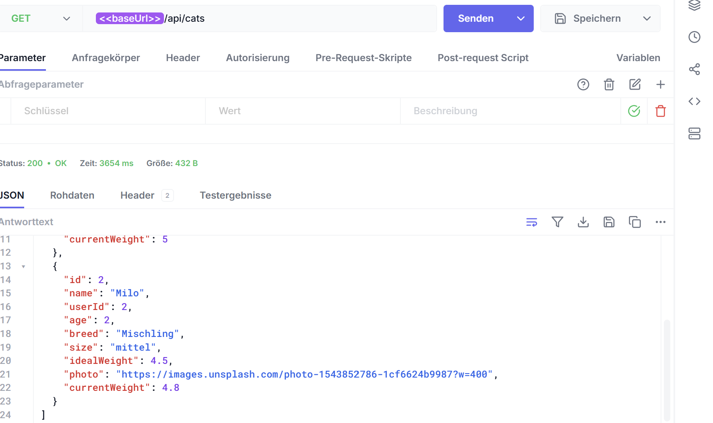

Fehlerfall:
- Request: GET /api/cats?userId=abc
- Erwartet: 400 Bad Request
- Ergebnis: 400 Bad Request
- Beleg: Fehlerfall (400 bei ungueltigem userId):
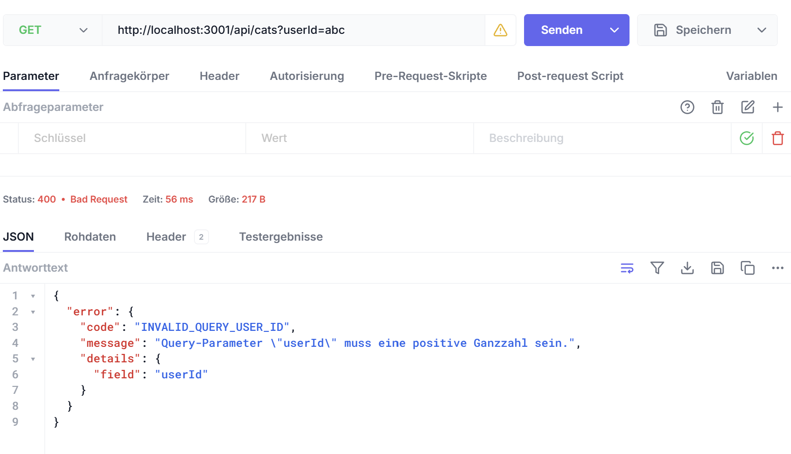

# 2) GET /api/cats/:id

Erfolgsfall:
- Request: GET /api/cats/1
- Erwartet: 200 OK
- Ergebnis: 200 OK
- Beleg: Erfolgsfall (200):
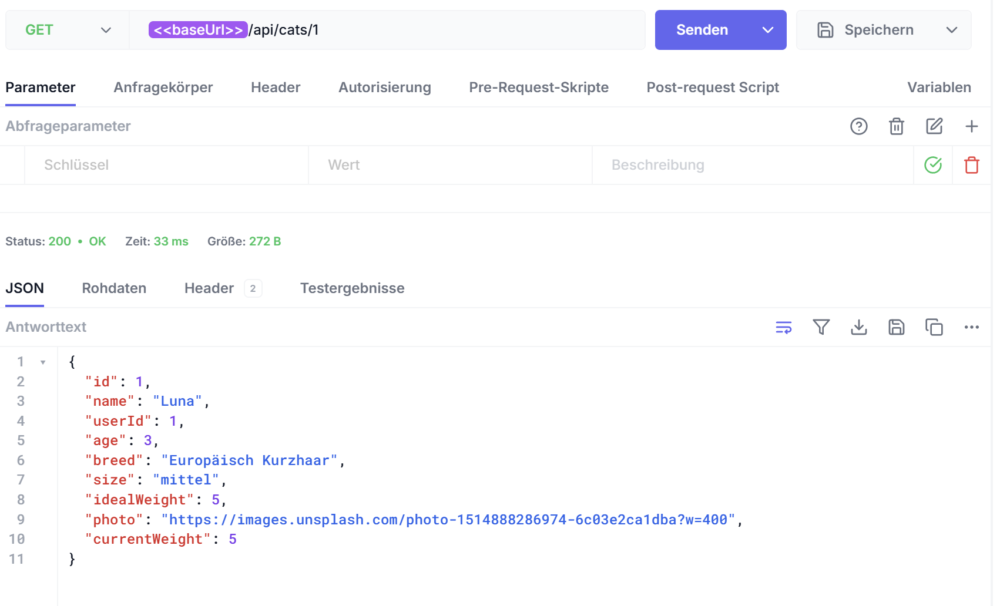

Fehlerfall:
- Request: GET /api/cats/999999
- Erwartet: 404 Not Found
- Ergebnis: 404 Not Found
- Beleg: Fehlerfall (404):
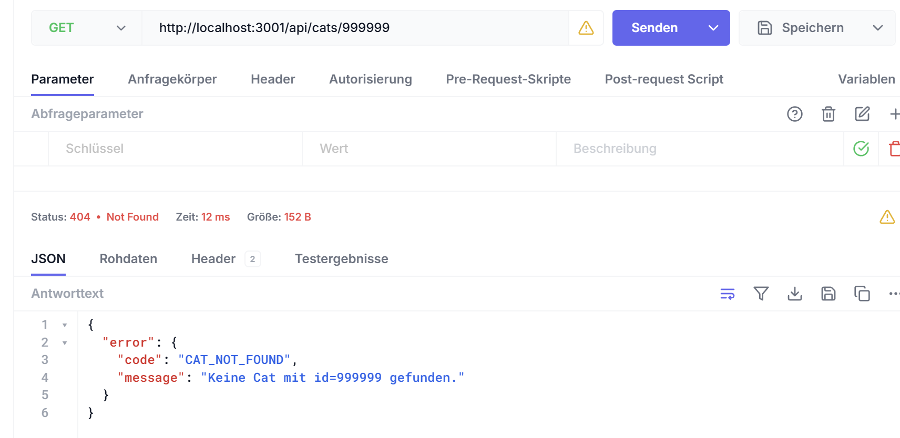

# 3) POST /api/cats

Erfolgsfall:
- Request: POST /api/cats mit gueltigem Body
- Erwartet: 201 Created
- Ergebnis: 201 Created
- Beleg: Erfolgsfall (201):
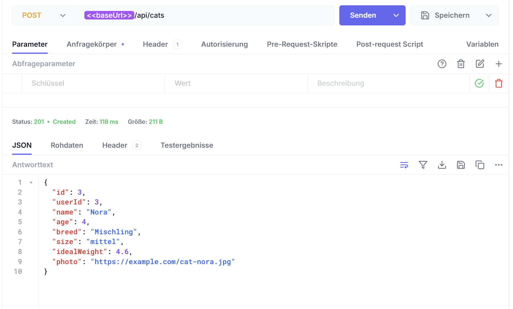

Fehlerfall:
- Request: POST /api/cats mit fehlendem Pflichtfeld name
- Erwartet: 400 Bad Request
- Ergebnis: 400 Bad Request
- Beleg: Fehlerfall (400, name fehlt):
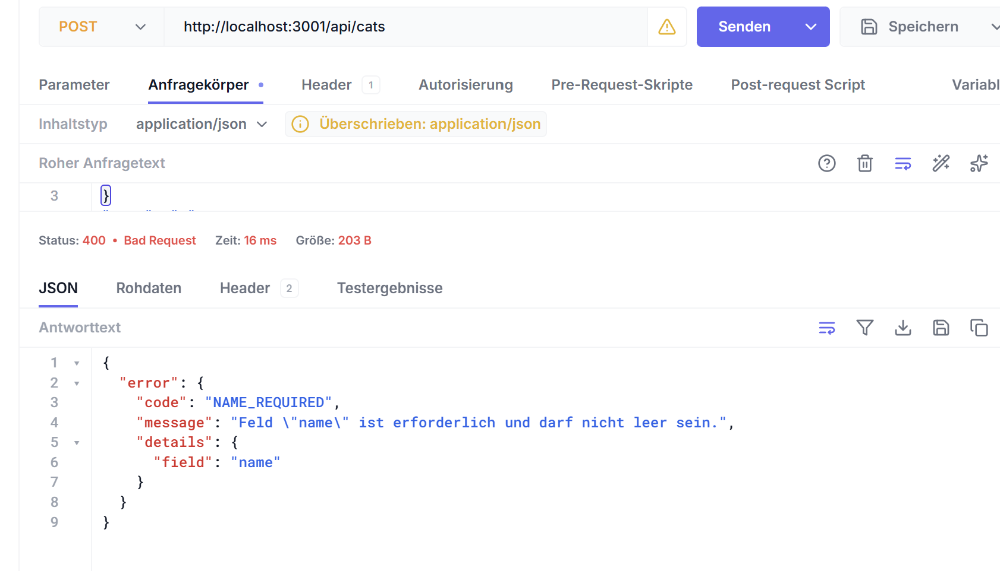

# 4) PUT /api/cats/:id

Erfolgsfall:
- Request: PUT /api/cats/1 mit gueltigem Body
- Erwartet: 200 OK
- Ergebnis: 200 OK
- Beleg: Erfolgsfall (200):
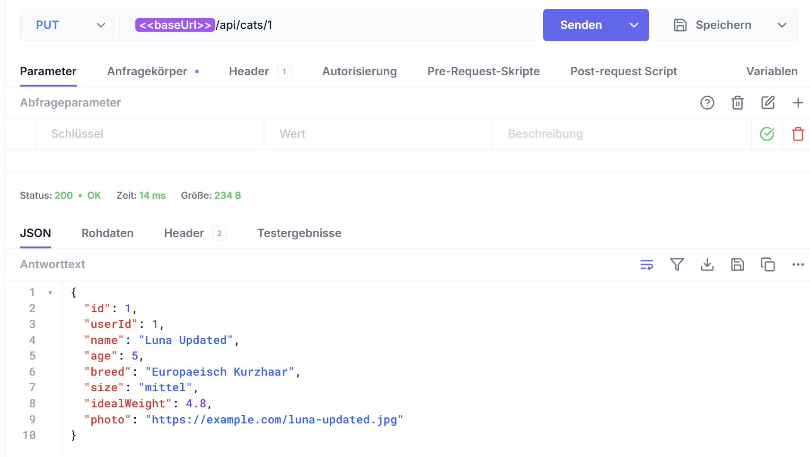

Fehlerfall:
- Request: PUT /api/cats/1 mit ungueltigen Daten (z. B. name leer)
- Erwartet: 400 Bad Request
- Ergebnis: 400 Bad Request
- Beleg: Fehlerfall (400, ungueltige Daten):
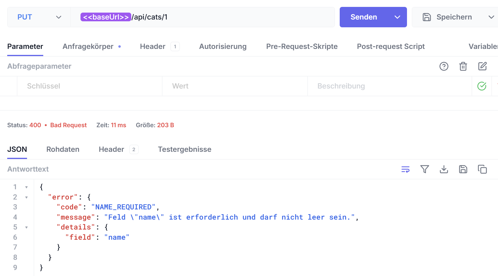

# 5) DELETE /api/cats/:id

Erfolgsfall:
- Request: DELETE /api/cats/2
- Erwartet: 204 No Content
- Ergebnis: 204 No Content
- Beleg: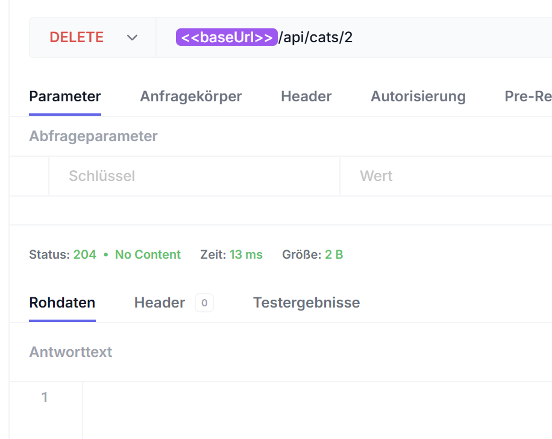

Fehlerfall:
- Request: DELETE /api/cats/999999
- Erwartet: 404 Not Found
- Ergebnis: 404 Not Found
- Beleg:Fehlerfall (404):
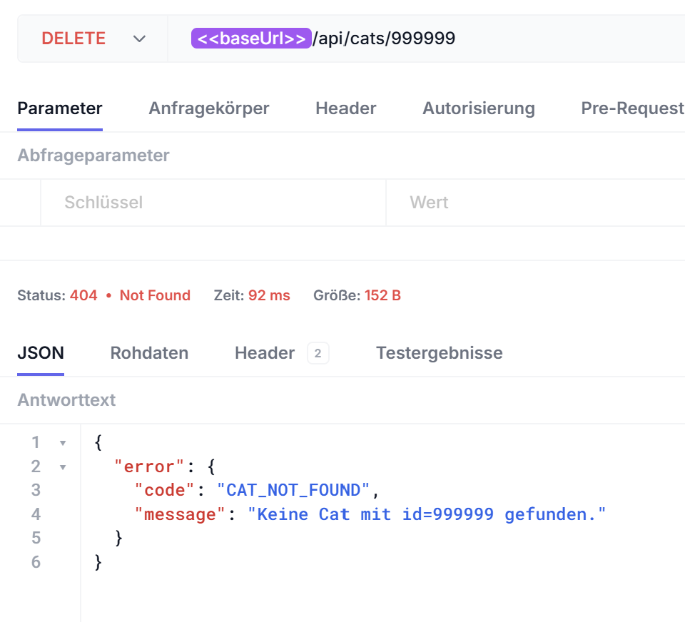

# Studio Session 4

# Datenschema

### users

| Feld | Typ | Constraint |
| --- | --- | --- |
| id | int | PK |
| email | string | NOT NULL, UNIQUE |
| name | string | NOT NULL |
| avatarUrl | string | optional |
| createdAt | datetime | NOT NULL |

### cats

| Feld | Typ | Constraint |
| --- | --- | --- |
| id | int | PK |
| userId | int | FK -> users.id, NOT NULL |
| name | string | NOT NULL |
| age | int | optional |
| breed | string | NOT NULL |
| size | enum | NOT NULL (klein, mittel, gross) |
| idealWeight | float | NOT NULL |
| photo | string | optional |
| createdAt | datetime | NOT NULL |

### weight_entries

| Feld | Typ | Constraint |
| --- | --- | --- |
| id | int | PK |
| catId | int | FK -> cats.id, NOT NULL |
| date | date | NOT NULL |
| weight | float | NOT NULL |

### calorie_entries

| Feld | Typ | Constraint |
| --- | --- | --- |
| id | int | PK |
| catId | int | FK -> cats.id, NOT NULL |
| date | date | NOT NULL |
| consumed | float | NOT NULL |
| burned | float | NOT NULL |
| basalBurned | float | NOT NULL |

### community_posts

| Feld | Typ | Constraint |
| --- | --- | --- |
| id | int | PK |
| userId | int | FK -> users.id, optional |
| author | string | NOT NULL |
| text | string | NOT NULL |
| photo | string | optional |
| beforeWeight | float | optional |
| nowWeight | float | optional |
| likes | int | NOT NULL, default 0 |
| hearts | int | NOT NULL, default 0 |
| createdAt | datetime | NOT NULL |

### post_reactions

| Feld | Typ | Constraint |
| --- | --- | --- |
| id | int | PK |
| postId | int | FK -> community_posts.id, NOT NULL |
| userId | int | FK -> users.id, NOT NULL |
| type | enum | NOT NULL (like, thumbsUp) |
| createdAt | datetime | NOT NULL |

### community_messages

| Feld | Typ | Constraint |
| --- | --- | --- |
| id | int | PK |
| userId | int | FK -> users.id, optional |
| userName | string | NOT NULL |
| avatar | string | optional |
| text | string | NOT NULL |
| createdAt | datetime | NOT NULL |

# Beziehungen

- users 1:n cats
- cats 1:n weight_entries
- cats 1:n calorie_entries
- community_posts 1:n post_reactions
- users 1:n post_reactions
- users n:m community_posts ueber post_reactions 

# Pflichtfelder

- users: email, name, createdAt
- cats: userId, name, breed, size, idealWeight, createdAt
- weight_entries: catId, date, weight
- calorie_entries: catId, date, consumed, burned, basalBurned
- community_posts: author, text, likes, hearts, createdAt
- post_reactions: postId, userId, type, createdAt
- community_messages: userName, text, createdAt

# Ersetzen der Mock-Daten-Handler

Für die Umstellung von Mock-Daten auf Prisma habe ich den Endpoint GET/api/cats in zwei Prompt-Iterationen umgesetzt.

Erste Iteration:

Ersetze den GET /api/cats-Handler. Bisher: res.json(cats). Neu: Alle Tasks aus der Datenbank laden mit prisma und als JSON zurückgeben. Fehlerbehandlung mit try/catch und 500-Status.

Zweite Iteration:

Ergänze den GET /api/cats-Handler um einen optionalen Query-Parameter userId mit where-Bedingung in Prisma. Wenn userId gesetzt ist, sollen nur die Cats dieses Users geladen werden; wenn kein userId gesetzt ist, weiterhin alle Cats zurückgeben. Bei ungültigem userId soll der Endpoint 400 Bad Request mit einer klaren Fehlermeldung zurückgeben.

# Persistenz-Test

Nach dem Senden des Eintrag POST /api/cats erhielt ich wie erwartet die Antwort Status 201 Created.

Beleg: 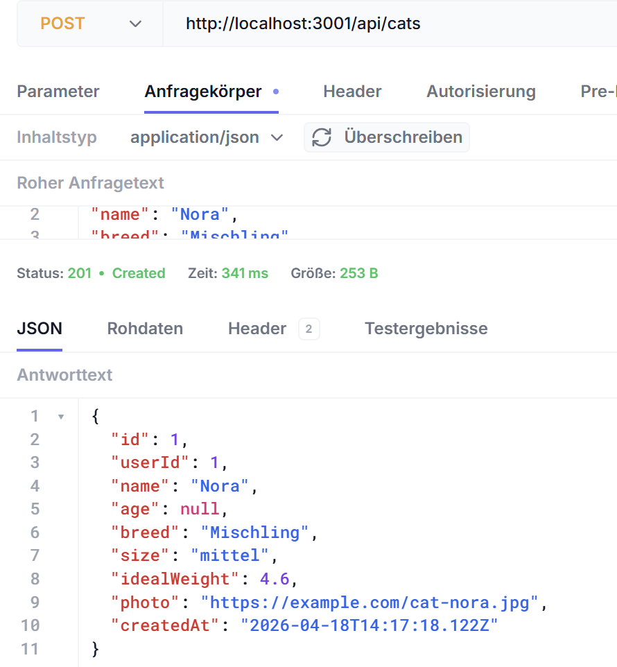

Anschließend wurde der Server gestoppt und wieder neu gestartet, um zu überprüfen, ob der Eintrag noch vorhanden ist. Dann wurde der Eintrag GET/api/cats gesendet und ich erhielt die Antwort Status 200 OK.

Beleg: 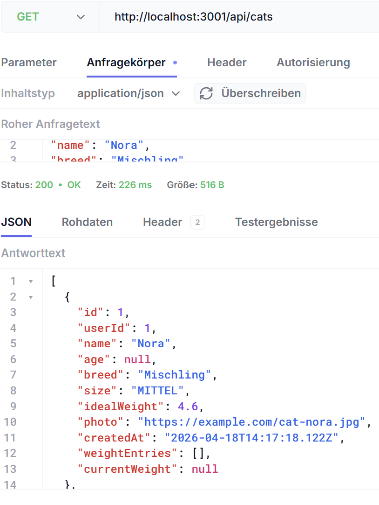

Der Test war erfolgreich, da der neu angelegte Eintrag nach dem Neustart weiterhin vorhanden war.

# Architekturentscheidung

Aus architektonischer Sicht sollten vor allem strukturierte und beziehungsreiche Daten in der Datenbank gespeichert werden,
zum Beispiel:
User, Cats, Gewichtseinträge und Community-Posts.

Redis wäre für kurzlebige Daten wie Sessions, Caching-Ergebnisse oder temporäre Zähler sinnvoll, da diese Daten schnell verfügbar sein müssen, aber nicht dauerhaft gespeichert werden.

Für Bilder und größere Uploads ist langfristig ein Cloud Object Store wie S3 geeigneter, damit die Datenbank entlastet wird und sich auf relationale Daten konzentrieren kann.